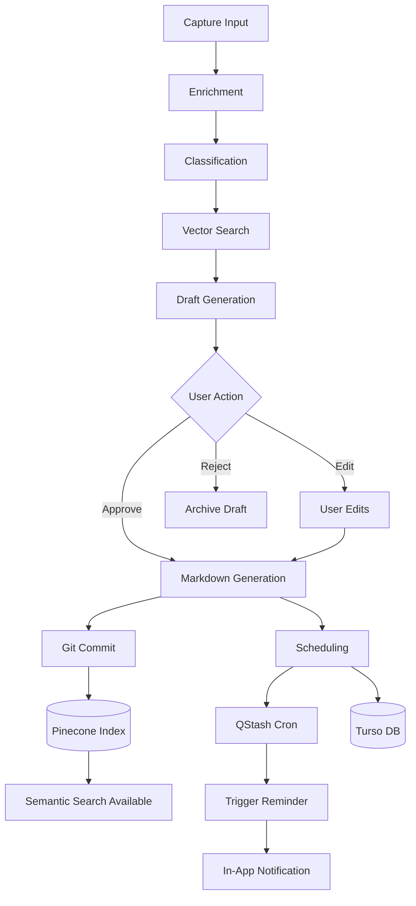
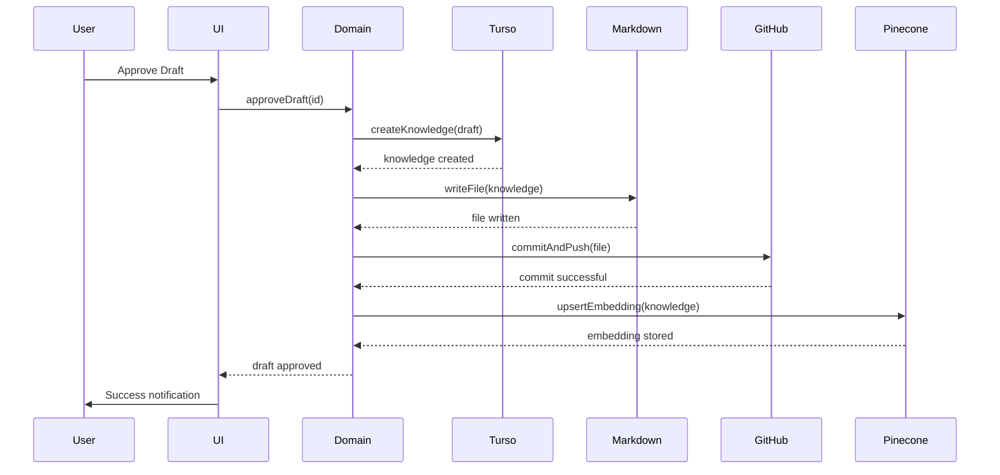
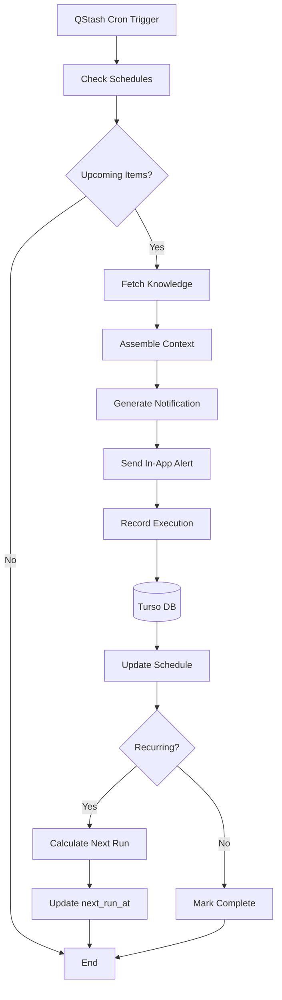

# Architecture Design — LE-REMINDER

## 1. System Architecture Overview

LE-REMINDER follows **Domain-Driven Design (DDD)** with **Hexagonal Architecture** (Ports & Adapters).

```
┌─────────────────────────────────────────────────────────────────────┐
│                           UI Layer                                   │
│   Next.js (App Router) + React + Shadcn/UI + TanStack Query + tRPC  │
└─────────────────────────────────┬───────────────────────────────────┘
                                  │
                                  ▼
┌─────────────────────────────────────────────────────────────────────┐
│                        Application Layer                            │
│           Use Cases / Command Handlers / Query Handlers              │
└─────────────────────────────────┬───────────────────────────────────┘
                                  │
                                  ▼
┌─────────────────────────────────────────────────────────────────────┐
│                          Domain Layer                               │
│     Entities / Value Objects / Domain Services / Repository Ports   │
│              (Framework-agnostic, Pure TypeScript)                  │
└─────────────────────────────────┬───────────────────────────────────┘
                                  │
                                  ▼
┌─────────────────────────────────────────────────────────────────────┐
│                      Infrastructure Layer                           │
│  ┌─────────┐  ┌─────────┐  ┌─────────┐  ┌─────────┐  ┌─────────┐  │
│  │  Turso  │  │ Pinecone │  │ QStash  │  │  GitHub │  │ Better  │  │
│  │ (SQLite)│  │ (Vector) │  │(Scheduler)│  │   API  │  │  Auth   │  │
│  └─────────┘  └─────────┘  └─────────┘  └─────────┘  └─────────┘  │
└─────────────────────────────────────────────────────────────────────┘
```

---

## 2. Bounded Contexts (Domains)

### 2.1 Capture Context
**Responsibility**: Accept and store raw user input

**Entities**:
- `Capture`: Raw input with timestamp, status (pending/processed)

**Ports**:
- `CaptureRepository`: Store/retrieve captures

**Adapters**:
- `TursoCaptureAdapter`: SQLite-based storage

---

### 2.2 Classification Context
**Responsibility**: AI-powered analysis of captures

**Entities**:
- `ClassificationResult`: Type, entities, keywords, confidence
- `Draft`: AI-generated structured content (pending approval)

**Ports**:
- `LLMService`: Interface for AI classification/draft generation
- `DraftRepository`: Store/retrieve drafts

**Adapters**:
- `OpenAIAdapter`: OpenAI GPT-4o for classification
- `PineconeVectorAdapter`: For similarity search during classification

---

### 2.3 Knowledge Context
**Responsibility**: Manage structured SOPs, habits, checklists

**Entities**:
- `SOP`: Standard Operating Procedure
- `Habit`: Recurring scheduled action
- `Checklist`: Grouped task items
- `MaintenanceRoutine`: Scheduled maintenance

**Ports**:
- `KnowledgeRepository`: Interface for CRUD operations
- `MarkdownStorage`: Interface for file system operations
- `GitSyncService`: Interface for version control

**Adapters**:
- `TursoKnowledgeAdapter`: Relational storage
- `FileSystemMarkdownAdapter`: Markdown file operations
- `GitHubApiAdapter`: Git commit/push operations

---

### 2.4 Scheduling Context
**Responsibility**: Time-based triggers and reminders

**Entities**:
- `Schedule`: Cron expression, next_run, last_run
- `Reminder`: Scheduled notification record
- `ExecutionState`: Track completion status

**Ports**:
- `SchedulerService`: Interface for scheduling operations
- `NotificationService`: Interface for delivering alerts

**Adapters**:
- `QStashSchedulerAdapter`: Upstash QStash for cron jobs
- `InAppNotificationAdapter`: UI-based notifications

---

### 2.5 Search Context
**Responsibility**: Semantic retrieval of knowledge

**Entities**:
- `SearchQuery`: User's natural language query
- `SearchResult`: Ranked results with relevance scores

**Ports**:
- `SearchService`: Interface for semantic search

**Adapters**:
- `PineconeSearchAdapter`: Vector similarity search

---

## 3. Service Boundaries

```
┌──────────────────────────────────────────────────────────────────────┐
│                         API Layer (tRPC)                             │
│   capture.submit   classification.process   knowledge.create       │
│   draft.approve    draft.reject              schedule.create        │
│   search.query     sync.trigger              auth.*                 │
└──────────────────────────────────────────────────────────────────────┘
```

### Public APIs

| Endpoint | Context | Description |
|----------|---------|-------------|
| `capture.submit` | Capture | Submit raw text input |
| `capture.list` | Capture | List user's captures |
| `classification.process` | Classification | Trigger AI processing |
| `draft.list` | Classification | List pending drafts |
| `draft.approve` | Classification | Approve and convert draft |
| `draft.reject` | Classification | Reject draft |
| `knowledge.create` | Knowledge | Create SOP/Habit manually |
| `knowledge.update` | Knowledge | Update existing SOP |
| `knowledge.delete` | Knowledge | Delete SOP |
| `schedule.create` | Scheduling | Schedule a habit/SOP |
| `schedule.list` | Scheduling | List scheduled items |
| `search.query` | Search | Semantic search |
| `sync.trigger` | Knowledge | Manual sync trigger |
| `auth.*` | Auth | Authentication endpoints |

---

## 4. Database Design (Turso)

### 4.1 ERD

```
┌─────────────────┐       ┌─────────────────┐       ┌─────────────────┐
│    captures     │       │     drafts      │       │    knowledge    │
├─────────────────┤       ├─────────────────┤       ├─────────────────┤
│ id (UUID)       │──────▶│ id (UUID)       │──────▶│ id (UUID)       │
│ user_id         │       │ capture_id      │       │ type (enum)     │
│ content         │       │ content         │       │ title           │
│ status          │       │ classification  │       │ content         │
│ created_at      │       │ status          │       │ category        │
│ processed_at    │       │ created_at      │       │ created_at      │
└─────────────────┘       │ approved_at     │       │ updated_at      │
                          └─────────────────┘       │ markdown_path    │
                                                     └─────────────────┘
                                                            │
                                                            ▼
                         ┌─────────────────┐       ┌─────────────────┐
                         │    schedules    │       │   embeddings    │
                         ├─────────────────┤       ├─────────────────┤
                         │ id (UUID)       │       │ id (UUID)       │
                         │ knowledge_id    │       │ knowledge_id    │
                         │ cron_expression │       │ vector_id       │
                         │ next_run_at     │       │ namespace       │
                         │ last_run_at     │       │ created_at      │
                         │ status          │       └─────────────────┘
                         └─────────────────┘
                                │
                                ▼
                         ┌─────────────────┐
                         │   executions    │
                         ├─────────────────┤
                         │ id (UUID)       │
                         │ schedule_id     │
                         │ executed_at     │
                         │ status          │
                         │ completion_note │
                         └─────────────────┘
```

### 4.2 Entities

#### `captures`
| Column | Type | Constraints |
|--------|------|-------------|
| id | TEXT | PRIMARY KEY |
| user_id | TEXT | NOT NULL |
| content | TEXT | NOT NULL |
| status | TEXT | DEFAULT 'pending' |
| created_at | INTEGER | NOT NULL |
| processed_at | INTEGER | NULL |

#### `drafts`
| Column | Type | Constraints |
|--------|------|-------------|
| id | TEXT | PRIMARY KEY |
| capture_id | TEXT | FOREIGN KEY |
| content | TEXT | NOT NULL |
| classification | TEXT | NOT NULL (JSON) |
| status | TEXT | DEFAULT 'pending' |
| created_at | INTEGER | NOT NULL |
| approved_at | INTEGER | NULL |

#### `knowledge`
| Column | Type | Constraints |
|--------|------|-------------|
| id | TEXT | PRIMARY KEY |
| type | TEXT | NOT NULL |
| title | TEXT | NOT NULL |
| content | TEXT | NOT NULL |
| category | TEXT | NULL |
| tags | TEXT | NULL (JSON array) |
| created_at | INTEGER | NOT NULL |
| updated_at | INTEGER | NOT NULL |
| markdown_path | TEXT | NOT NULL |

#### `schedules`
| Column | Type | Constraints |
|--------|------|-------------|
| id | TEXT | PRIMARY KEY |
| knowledge_id | TEXT | FOREIGN KEY |
| cron_expression | TEXT | NOT NULL |
| next_run_at | INTEGER | NOT NULL |
| last_run_at | INTEGER | NULL |
| status | TEXT | DEFAULT 'active' |

#### `embeddings`
| Column | Type | Constraints |
|--------|------|-------------|
| id | TEXT | PRIMARY KEY |
| knowledge_id | TEXT | FOREIGN KEY |
| vector_id | TEXT | NOT NULL |
| namespace | TEXT | NOT NULL |
| created_at | INTEGER | NOT NULL |

#### `executions`
| Column | Type | Constraints |
|--------|------|-------------|
| id | TEXT | PRIMARY KEY |
| schedule_id | TEXT | FOREIGN KEY |
| executed_at | INTEGER | NOT NULL |
| status | TEXT | NOT NULL |
| completion_note | TEXT | NULL |

### 4.3 Indexing Strategy

```sql
-- Capture lookup by user and status
CREATE INDEX idx_captures_user_status ON captures(user_id, status);

-- Draft lookup by status
CREATE INDEX idx_drafts_status ON drafts(status);

-- Knowledge lookup by type and category
CREATE INDEX idx_knowledge_type_category ON knowledge(type, category);

-- Schedule lookup by next_run_at
CREATE INDEX idx_schedules_next_run ON schedules(next_run_at);

-- Embedding lookup by knowledge_id
CREATE INDEX idx_embeddings_knowledge ON embeddings(knowledge_id);
```

---

## 5. Vector Architecture (Pinecone)

### 5.1 Namespace Strategy

```
Pinecone Index: le-reminder-knowledge
├── Namespace: knowledge      # Approved SOPs, habits
├── Namespace: drafts         # AI drafts (for similarity during classification)
└── Namespace: captures       # Raw captures (for pattern detection)
```

### 5.2 Embedding Lifecycle

```
1. User approves draft → knowledge record created
2. Knowledge content → embedded via OpenAI text-embedding-3-small
3. Vector stored in Pinecone (namespace: knowledge)
4. Vector ID stored in Turso embeddings table
5. On knowledge update → re-embed and update Pinecone
6. On knowledge delete → delete from Pinecone
```

### 5.3 Synchronization Flow

```
┌─────────────┐         ┌─────────────┐         ┌─────────────┐
│   Turso     │◀───────▶│   App       │◀───────▶│  Pinecone   │
│  (SQLite)   │         │  Domain     │         │  (Vectors)  │
└─────────────┘         └─────────────┘         └─────────────┘
        │                       │
        │                       │
        ▼                       ▼
┌─────────────┐         ┌─────────────┐
│   .md       │         │  GitHub     │
│  (Files)    │         │   API       │
└─────────────┘         └─────────────┘
```

**Sync Rules**:
- Turso is source of truth for metadata and operational state
- Pinecone is updated on knowledge create/update/delete
- Markdown files are written on knowledge create/update
- GitHub commits are triggered on knowledge approve/update

---

## 6. File System Strategy

### 6.1 Markdown Organization

```
/knowledge
├── /sops
│   ├── yyyy-mm-dd-slug-title.md
│   └── ...
├── /habits
│   ├── yyyy-mm-dd-slug-title.md
│   └── ...
├── /checklists
│   └── ...
└── /routines
    └── ...
```

### 6.2 Frontmatter Standards

```yaml
---
id: uuid-v4
type: sop | habit | checklist | routine
title: Human Readable Title
slug: url-friendly-slug
category: category-name
tags: [tag1, tag2, tag3]
schedule: "0 9 * * *"  # Cron expression (if applicable)
createdAt: 2026-05-12T00:00:00Z
updatedAt: 2026-05-12T00:00:00Z
gitCommitHash: abc1234
---

# Content below frontmatter
```

### 6.3 Content Identity

- **Identity**: UUID v4 stored in frontmatter
- **Slug**: Auto-generated from title, collision-resistant
- **Path**: `/knowledge/{type}/{date}-{slug}.md`

### 6.4 Sync Semantics

```
User Action                    │ Markdown        │ Turso          │ Pinecone
──────────────────────────────┼─────────────────┼────────────────┼──────────
Submit capture                 │ —               │ capture created│ —
AI processes (background)      │ —               │ draft created  │ —
Approve draft                  │ .md created     │ knowledge created│ vector added
Manual edit SOP               │ .md updated     │ knowledge updated│ vector updated
Delete SOP                     │ .md deleted     │ knowledge deleted│ vector deleted
```

---

## 7. Mermaid Diagrams

### 7.1 Chaotic Input → Structured Output Pipeline



### 7.2 Synchronization Flow



### 7.3 Reminder Execution Flow



---

## 8. Key Architectural Decisions

### ADR-001: Markdown as Primary Source of Truth
**Decision**: Standard `.md` files are the canonical storage for knowledge content
**Rationale**: Portable, human-readable, version-controlled, vendor-agnostic
**Consequence**: Database stores metadata only; content lives in files

### ADR-002: Human-in-the-Loop for AI Output
**Decision**: All AI-generated drafts require explicit user approval
**Rationale**: Prevent hallucinations from corrupting knowledge base; build trust
**Consequence**: Draft state machine; approval workflow in UI

### ADR-003: Semi-Automated Git Sync
**Decision**: Git commits happen automatically on approve/edit, not on every change
**Rationale**: Balance between convenience and avoiding commit spam
**Consequence**: Git commit triggered from domain events

### ADR-004: Single Namespace per Entity Type
**Decision**: Pinecone uses separate namespaces for captures, drafts, knowledge
**Rationale**: Isolation for different query use cases; easier management
**Consequence**: Index management per namespace

---

## 9. Technology Mapping

| Layer | Technology | Role |
|-------|------------|------|
| UI Framework | Next.js App Router | Server components, API routes |
| State Management | TanStack Query | Server state, caching |
| API Layer | tRPC | Type-safe APIs |
| Auth | Better Auth | Session, providers |
| ORM | Drizzle ORM | Type-safe SQL |
| Relational DB | Turso (SQLite) | Metadata, schedules |
| Vector DB | Pinecone | Semantic search |
| Scheduler | Upstash QStash | Cron jobs, webhooks |
| Runtime | Bun | Development, builds |
| Hosting | Vercel | Deployment, serverless |
